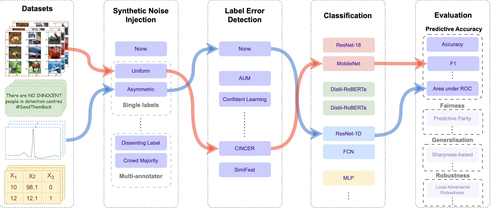
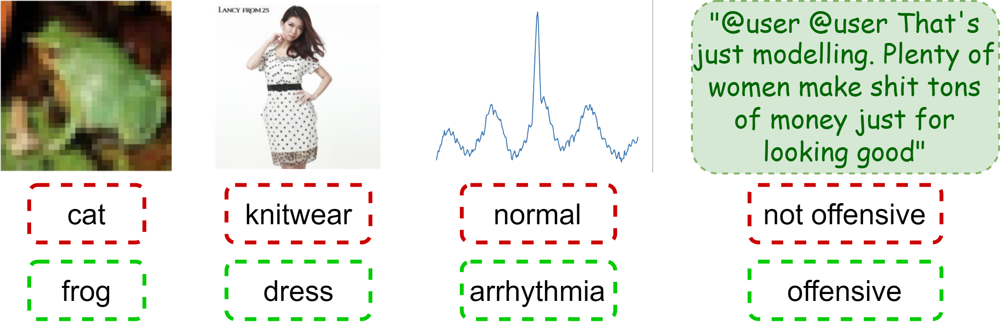
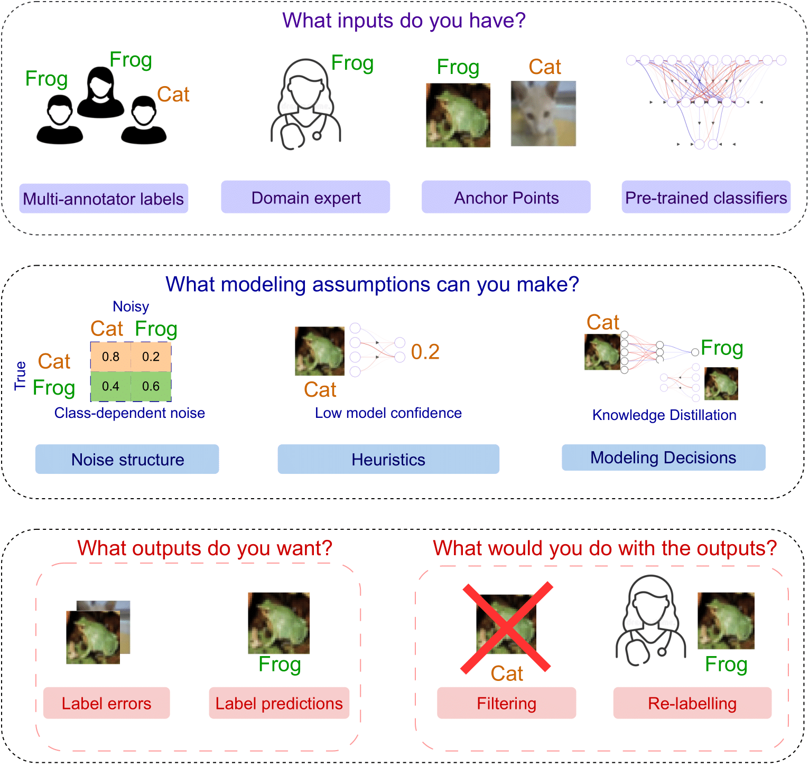

<h1 align="center">AQuA: A Benchmarking Tool for Label Quality Assessment</h1>
<h3 align="center">A benchmarking environment to rigorously evaluate methods that enable machine learning in the presence of label noise</h3>

Machine learning (ML) models are only as good as the data they are trained on. But recent studies have found datasets widely used to train and evaluate ML models, e.g. _ImageNet_, to have pervasive labeling errors. Erroneous labels on the train set hurt ML models' ability to generalize, and they impact evaluation and model selection using the test set. Consequently, learning in the presence of labeling errors is an active area of research, yet this field lacks a comprehensive benchmark to evaluate these methods. Most of these methods are evaluated on a few computer vision datasets with significant variance in the experimental protocols. With such a large pool of methods and inconsistent evaluation, it is also unclear how ML practitioners can choose the right models to assess label quality in their data. To this end, we propose a benchmarking environment `AQuA` to rigorously evaluate methods that enable machine learning in the presence of label noise. We also introduce a design space to delineate concrete design choices of label error detection models. We hope that our proposed design space and benchmark enable practitioners to choose the right tools to improve their label quality and that our benchmark enables objective and rigorous evaluation of machine learning tools facing mislabeled data.

<p align="center">

</p>

Figure 1: _Overview of the `AQuA` benchmark framework_. `AQuA` comprises of datasets from **4** modalities, **4** single-label and **3** multi-annotator label noise injection methods, **4** state-of-the-art label error detection models, classification models, and several evaluation metrics beyond metrics of predictive accuracy. We are in the process of integrating several fairness, generalization, and robustness metrics into `AQuA`. The red and blue arrows show two example experimental pipelines for image data and time-series data, respectively. 

<p align="center">

</p>

Figure 2: Labeling errors in widely used benchmarks: CIFAR-10, Clothing-100K, MIT-BIH, and TweetEval Hate Speech datasets. Observed labels are in red and true labels are in green.

----

## Contents

1. [Design Space](#design_space)
2. [Datasets](#datasets)
3. [Classification Models](#models)
4. [Cleaning Methods](#cleaning_methods)
5. [Synthetic Noise](#syn_noise)
6. [Compatibility and Installation](#installation)
7. [Results](#results)
8. [Citation](#citation)
9. [Sources and their Licenses](#sources)
10. [License](#license)

<a id="design_space"></a>
### A Design Space of Label Error Detection Methods


<p align="center">

</p>

Figure 3: Design space of labeling error detection models to delineate concrete design choices. For more details, check out Section 3 in our [paper](https://arxiv.org/pdf/2306.09467.pdf). 

<a id="datasets"></a>
## List of supported datasets
* Text
    * IMDB Sentiment Analysis (name:`imdb`)
    * TweetEval (name:`tweeteval`)
* Time-Series
    * MIT-BIH Arrhythmia Detection Dataset (name: `mitbih`)
    * PenDigits: Differentiate between time-series pen tracings of different handwritten digits (name: `pendigits`)
    * ElectricDevices: Track usage of electric devices (name: `electricdevices`)
    * Crop: Differentiate between different crops based on plant characteristics (name: `crop`)
    * WhaleCalls: Classify audio signals as a right whale up-call or not (name: `whalecalls`)
* Vision
    * CIFAR-10 (name: `cifar10`)
    * Noisy CXR : Classify pneumonia based on chest x-rays (name: `cxr`)
    * Clothing100K : Classify clothing images (name: `clothing`)
* Tabular
    * Credit Card Fraud Detection: Classify credit card transaction features into fraud or not (name: `credit_fraud`)
    * Mushrooms: Classify edibility of mushrooms (name: `mushrooms`)
    * Adult: Classify income of adults (name: `adult`)
    * Dry Bean: Classify species of beans (name: `dry_bean`)
    * COMPAS: Correctional Offender Management Profiling for Alternative Sanctions (name: `compas`)
    * Car Evaluation: Classify condition of cars (name: `car_evaluation`)

<a id="models"></a>
## List of Supported Models:
* Text:
    * MiniLM-L6 (name: ` all-MiniLM-L6-v2`)
    * DistilRoBERTa (name: `all-distilroberta-v1`)
* Vision:
    * ResNet-18 (name: `resnet18`)
    * MobileNet-v2 (name: `mobilenet_v2`) 
* Time-Series:
    * ResNet-1D (name: `resnet1d`)
    * LSTM-FCN (name: `fcn`)
* Tabular:
    * MLP (name: `mlp`)

<a id="cleaning_methods"></a>
## List of Supported Cleaning Methods

* AUM (name: `aum`)
* CINCER (name: `cincer`)
* SimiFeat (name: `simifeat`)
* Cleanlab (name: `cleanlab`)

All names indicated inside parentheses can be used to fill `aqua/configs/main_config.json`. `main_config.json` is the main entry point for setting up experiments. Each  dataset, model and cleaning method have their own config files under `aqua/configs/datasets`, `aqua/configs/models/base` and `aqua/configs/models/cleaning` respectively.

<a id="syn_noise"></a>
## Synthetic Noise
* For single-label datasets:
    * Uniform Noise
    * Class-dependent Noise
    * Asymmetric Label Noise
    * Instance-dependent Label Noise
* For datasets with labels from multiple annotators:
    * Dissenting Label
    * Dissenting Worker
    * Crowd Majority

<a id="installation"></a>
## Compatibility and Installation

`aqua` requires `python` 3.7+ to install. 

For a full list of dependencies required to run `aqua`, please refer to `requirements.txt`. 

To install `aqua`, run the following:

```console
foo@bar:~$ git clone https://github.com/autonlab/aqua.git
foo@bar:~$ python setup.py install
```

<a id="results"></a>
## Results

<table>
    <tr>
        <td><b>Datasets</td>
        <td colspan=5><center><b>No Noise Injected</td>
        <td colspan=5><center><b>Assymmetric</td>
        <td colspan=5><center><b>Class-dependent</td>
        <td colspan=5><center><b>Instance-dependent</td>
        <td colspan=5><center><b>Uniform</td>
    </tr>
    <tr>
        <td></td>
        <td><b>NON</td>
        <td><b>AUM</td>
        <td><b>CIN</td>
        <td><b>CON</td>
        <td><b>SIM</td>
        <td><b>NON</td>
        <td><b>AUM</td>
        <td><b>CIN</td>
        <td><b>CON</td>
        <td><b>SIM</td>
        <td><b>NON</td>
        <td><b>AUM</td>
        <td><b>CIN</td>
        <td><b>CON</td>
        <td><b>SIM</td>
        <td><b>NON</td>
        <td><b>AUM</td>
        <td><b>CIN</td>
        <td><b>CON</td>
        <td><b>SIM</td>
        <td><b>NON</td>
        <td><b>AUM</td>
        <td><b>CIN</td>
        <td><b>CON</td>
        <td><b>SIM</td>
    </tr>
    <tr>
        <td>Crop</td>
        <td>58.4</td>
        <td>57.8</td>
        <td>53.1</td>
        <td>12.4</td>
        <td>56.5</td>
        <td>47.4</td>
        <td>49.6</td>
        <td>46.8</td>
        <td>13.7</td>
        <td>46.3</td>
        <td>47.5</td>
        <td>47.1</td>
        <td>42.3</td>
        <td>13.5</td>
        <td>43.9</td>
        <td>42.9</td>
        <td>35.3</td>
        <td>37.9</td>
        <td>8.5</td>
        <td>48.5</td>
        <td>48.1</td>
        <td>54.9</td>
        <td>54.7</td>
        <td>13.7</td>
        <td>54.1</td>
    </tr>
    <tr>
        <td>Electric Devices</td>
        <td>63.2</td>
        <td>67.2</td>
        <td>67.3</td>
        <td>39.9</td>
        <td>65.3</td>
        <td>56.4</td>
        <td>55.0</td>
        <td>54.3</td>
        <td>37.3</td>
        <td>56.2</td>
        <td>34.2</td>
        <td>31.0</td>
        <td>34.6</td>
        <td>24.9</td>
        <td>33.7</td>
        <td>50.7</td>
        <td>46.8</td>
        <td>50.9</td>
        <td>28.9</td>
        <td>53.2</td>
        <td>57.9</td>
        <td>57.9</td>
        <td>60.7</td>
        <td>35.3</td>
        <td>55.1</td>
    </tr>
    <tr>
        <td>MIT-BIH</td>
        <td>76.0</td>
        <td>64.8</td>
        <td>86.9</td>
        <td>72.5</td>
        <td>76.4</td>
        <td>75.3</td>
        <td>78.2</td>
        <td>72.1</td>
        <td>52.3</td>
        <td>71.6</td>
        <td>82.4</td>
        <td>80.5</td>
        <td>83.2</td>
        <td>76.2</td>
        <td>82.2</td>
        <td>67.0</td>
        <td>71.9</td>
        <td>75.1</td>
        <td>66.3</td>
        <td>77.4</td>
        <td>84.5</td>
        <td>77.1</td>
        <td>87.3</td>
        <td>74.3</td>
        <td>81.8</td>
    </tr>
    <tr>
        <td>PenDigits</td>
        <td>96.2</td>
        <td>96.7</td>
        <td>95.4</td>
        <td>58.3</td>
        <td>95.8</td>
        <td>81.8</td>
        <td>84.4</td>
        <td>80.7</td>
        <td>34.5</td>
        <td>83.9</td>
        <td>49.8</td>
        <td>55.2</td>
        <td>54.8</td>
        <td>19.6</td>
        <td>53.0</td>
        <td>84.4</td>
        <td>77.4</td>
        <td>81.7</td>
        <td>22.4</td>
        <td>85.2</td>
        <td>93.8</td>
        <td>96.3</td>
        <td>95.4</td>
        <td>39.6</td>
        <td>94.8</td>
    </tr>
    <tr>
        <td>WhaleCalls</td>
        <td>85.6</td>
        <td>34.7</td>
        <td>59.6</td>
        <td>62.4</td>
        <td>62.9</td>
        <td>52.5</td>
        <td>63.7</td>
        <td>52.2</td>
        <td>48.9</td>
        <td>54.3</td>
        <td>39.1</td>
        <td>41.1</td>
        <td>40.3</td>
        <td>41.9</td>
        <td>41.9</td>
        <td>51.4</td>
        <td>58.9</td>
        <td>68.5</td>
        <td>47.8</td>
        <td>50.8</td>
        <td>53.5</td>
        <td>42.8</td>
        <td>60.5</td>
        <td>44.5</td>
        <td>62.2</td>
    </tr>
    <tr>
        <td>Adult</td>
        <td>84.4</td>
        <td>84.4</td>
        <td>84.2</td>
        <td>77.7</td>
        <td>84.3</td>
        <td>83.6</td>
        <td>83.2</td>
        <td>83.2</td>
        <td>76.9</td>
        <td>83.1</td>
        <td>82.3</td>
        <td>82.5</td>
        <td>83.4</td>
        <td>83.5</td>
        <td>82.6</td>
        <td>82.4</td>
        <td>82.6</td>
        <td>83.1</td>
        <td>69.3</td>
        <td>82.2</td>
        <td>83.5</td>
        <td>83.5</td>
        <td>83.4</td>
        <td>68.0</td>
        <td>83.7</td>
    </tr>
    <tr>
        <td>Car Evaluation</td>
        <td>92.4</td>
        <td>89.9</td>
        <td>79.7</td>
        <td>57.6</td>
        <td>89.3</td>
        <td>82.9</td>
        <td>81.4</td>
        <td>64.5</td>
        <td>59.0</td>
        <td>75.8</td>
        <td>90.3</td>
        <td>86.6</td>
        <td>83.3</td>
        <td>57.6</td>
        <td>85.0</td>
        <td>77.3</td>
        <td>75.9</td>
        <td>68.7</td>
        <td>58.4</td>
        <td>73.7</td>
        <td>81.1</td>
        <td>76.3</td>
        <td>73.1</td>
        <td>57.6</td>
        <td>74.3</td>
    </tr>
    <tr>
        <td>COMPAS</td>
        <td>66.9</td>
        <td>66.8</td>
        <td>65.9</td>
        <td>65.5</td>
        <td>66.4</td>
        <td>65.2</td>
        <td>65.6</td>
        <td>65.6</td>
        <td>33.8</td>
        <td>66.0</td>
        <td>38.2</td>
        <td>66.6</td>
        <td>64.8</td>
        <td>36.7</td>
        <td>67.1</td>
        <td>64.4</td>
        <td>65.3</td>
        <td>58.3</td>
        <td>49.4</td>
        <td>64.5</td>
        <td>65.0</td>
        <td>58.0</td>
        <td>64.5</td>
        <td>62.4</td>
        <td>65.1</td>
    </tr>
    <tr>
        <td>Credit Fraud</td>
        <td>100.0</td>
        <td>100.0</td>
        <td>99.9</td>
        <td>99.9</td>
        <td>100.0</td>
        <td>99.9</td>
        <td>99.9</td>
        <td>99.9</td>
        <td>99.8</td>
        <td>99.9</td>
        <td>99.9</td>
        <td>99.9</td>
        <td>99.9</td>
        <td>99.8</td>
        <td>100.0</td>
        <td>99.9</td>
        <td>99.7</td>
        <td>99.8</td>
        <td>99.9</td>
        <td>99.7</td>
        <td>99.9</td>
        <td>99.9</td>
        <td>99.9</td>
        <td>75.0</td>
        <td>99.9</td>
    </tr>
    <tr>
        <td>Dry Bean</td>
        <td>92.0</td>
        <td>91.2</td>
        <td>91.0</td>
        <td>67.3</td>
        <td>90.8</td>
        <td>82.5</td>
        <td>84.6</td>
        <td>88.8</td>
        <td>51.7</td>
        <td>84.6</td>
        <td>91.2</td>
        <td>89.8</td>
        <td>89.3</td>
        <td>19.8</td>
        <td>88.2</td>
        <td>84.8</td>
        <td>81.7</td>
        <td>83.0</td>
        <td>40.5</td>
        <td>87.3</td>
        <td>86.0</td>
        <td>90.6</td>
        <td>90.7</td>
        <td>62.1</td>
        <td>62.1</td>
    </tr>
    <tr>
        <td>Mushrooms</td>
        <td>99.5</td>
        <td>100.0</td>
        <td>99.3</td>
        <td>99.7</td>
        <td>99.8</td>
        <td>98.1</td>
        <td>98.3</td>
        <td>98.3</td>
        <td>81.6</td>
        <td>98.9</td>
        <td>99.3</td>
        <td>100.0</td>
        <td>98.6</td>
        <td>98.4</td>
        <td>99.8</td>
        <td>96.2</td>
        <td>96.8</td>
        <td>96.4</td>
        <td>75.7</td>
        <td>95.9</td>
        <td>98.9</td>
        <td>98.0</td>
        <td>98.2</td>
        <td>89.3</td>
        <td>98.5</td>
    </tr>
    <tr>
        <td>CIFAR-10</td>
        <td>80.7</td>
        <td>80.5</td>
        <td>80.3</td>
        <td>38.3</td>
        <td>79.9</td>
        <td>53.5</td>
        <td>65.1</td>
        <td>64.1</td>
        <td>28.5</td>
        <td>65.3</td>
        <td>77.7</td>
        <td>78.6</td>
        <td>78.5</td>
        <td>42.0</td>
        <td>71.9</td>
        <td>57.2</td>
        <td>62.8</td>
        <td>65.4</td>
        <td>24.9</td>
        <td>63.8</td>
        <td>66.0</td>
        <td>64.3</td>
        <td>69.2</td>
        <td>25.1</td>
        <td>66.3</td>
    </tr>
    <tr>
        <td>Chest X-rays</td>
        <td>64.4</td>
        <td>65.2</td>
        <td>65.0</td>
        <td>15.0</td>
        <td>63.9</td>
        <td>51.4</td>
        <td>50.3</td>
        <td>54.2</td>
        <td>8.1</td>
        <td>50.2</td>
        <td>63.3</td>
        <td>62.9</td>
        <td>65.4</td>
        <td>7.9</td>
        <td>63.5</td>
        <td>48.4</td>
        <td>48.4</td>
        <td>52.4</td>
        <td>10.6</td>
        <td>48.9</td>
        <td>52.7</td>
        <td>52.4</td>
        <td>59.5</td>
        <td>9.6</td>
        <td>51.5</td>
    </tr>
    <tr>
        <td>Clothing-100K</td>
        <td>91.0</td>
        <td>90.7</td>
        <td>90.7</td>
        <td>90.9</td>
        <td>90.7</td>
        <td>80.9</td>
        <td>77.4</td>
        <td>72.7</td>
        <td>74.7</td>
        <td>77.6</td>
        <td>85.1</td>
        <td>80.4</td>
        <td>80.3</td>
        <td>90.6</td>
        <td>87.1</td>
        <td>74.6</td>
        <td>61.1</td>
        <td>70.7</td>
        <td>77.3</td>
        <td>74.6</td>
        <td>77.2</td>
        <td>74.1</td>
        <td>77.2</td>
        <td>84.6</td>
        <td>76.0</td>
    </tr>
    <tr>
        <td>IMDb</td>
        <td>84.9</td>
        <td>87.5</td>
        <td>89.2</td>
        <td>69.6</td>
        <td>90.3</td>
        <td>70.1</td>
        <td>57.7</td>
        <td>73.3</td>
        <td>60.3</td>
        <td>76.4</td>
        <td>87.1</td>
        <td>84.9</td>
        <td>89.1</td>
        <td>85.5</td>
        <td>87.1</td>
        <td>58.7</td>
        <td>57.6</td>
        <td>59.4</td>
        <td>55.0</td>
        <td>55.5</td>
        <td>59.4</td>
        <td>56.0</td>
        <td>61.0</td>
        <td>58.5</td>
        <td>60.9</td>
    </tr>
    <tr>
        <td>TweetEval</td>
        <td>73.6</td>
        <td>73.6</td>
        <td>77.1</td>
        <td>65.1</td>
        <td>76.8</td>
        <td>65.9</td>
        <td>65.5</td>
        <td>68.7</td>
        <td>55.2</td>
        <td>69.6</td>
        <td>77.0</td>
        <td>80.1</td>
        <td>78.7</td>
        <td>51.4</td>
        <td>77.9</td>
        <td>66.1</td>
        <td>67.6</td>
        <td>68.2</td>
        <td>67.5</td>
        <td>55.8</td>
        <td>71.2</td>
        <td>68.2</td>
        <td>73.8</td>
        <td>45.4</td>
        <td>70.1</td>
    </tr>
</table>

Table 1: Impact of label noise on weighted F1 score of a downstream model for each modality on the test set, averaged across noise rates and downstream models.


<table>
    <tr>
        <td>Datasets</td>
        <td colspan=4><center><b>Asymmetric</td>
        <td colspan=4><center><b>Class-dependent</td>
        <td colspan=4><center><b>Instance-dependent</td>
        <td colspan=4><center><b>Uniform</td>
    </tr>
    <tr>
        <td></td>
        <td><b>AUM</td>
        <td><b>CIN</td>
        <td><b>CON</td>
        <td><b>SIM</td>
        <td><b>AUM</td>
        <td><b>CIN</td>
        <td><b>CON</td>
        <td><b>SIM</td>
        <td><b>AUM</td>
        <td><b>CIN</td>
        <td><b>CON</td>
        <td><b>SIM</td>
        <td><b>AUM</td>
        <td><b>CIN</td>
        <td><b>CON</td>
        <td><b>SIM</td>
    </tr>
    <tr>
        <td>Crop</td>
        <td>65.5</td>
        <td>65.6</td>
        <td>21.3</td>
        <td>70.3</td>
        <td>40.8</td>
        <td>61.1</td>
        <td>32.9</td>
        <td>60.7</td>
        <td>59.4</td>
        <td>57.7</td>
        <td>25.1</td>
        <td>68.9</td>
        <td>65.8</td>
        <td>76.4</td>
        <td>21.7</td>
        <td>77.3</td>
    </tr>
    <tr>
        <td>Electric Devices</td>
        <td>65.2</td>
        <td>74.3</td>
        <td>38.8</td>
        <td>74.7</td>
        <td>41.3</td>
        <td>67.7</td>
        <td>51.1</td>
        <td>64.9</td>
        <td>60.1</td>
        <td>64.8</td>
        <td>31.7</td>
        <td>71.9</td>
        <td>65.5</td>
        <td>82.8</td>
        <td>33.2</td>
        <td>81.1</td>
    </tr>
    <tr>
        <td>MIT-BIH</td>
        <td>65.3</td>
        <td>78.1</td>
        <td>48.6</td>
        <td>70.6</td>
        <td>55.5</td>
        <td>67.3</td>
        <td>45.6</td>
        <td>75.3</td>
        <td>59.7</td>
        <td>70.6</td>
        <td>47.6</td>
        <td>71.1</td>
        <td>65.1</td>
        <td>86.6</td>
        <td>50.0</td>
        <td>81.9</td>
    </tr>
    <tr>
        <td>PenDigits</td>
        <td>65.3</td>
        <td>81.5</td>
        <td>26.6</td>
        <td>73.6</td>
        <td>51.9</td>
        <td>51.1</td>
        <td>49.7</td>
        <td>78.9</td>
        <td>59.6</td>
        <td>78.0</td>
        <td>23.6</td>
        <td>74.5</td>
        <td>65.6</td>
        <td>94.7</td>
        <td>26.1</td>
        <td>75.1</td>
    </tr>
    <tr>
        <td>WhaleCalls</td>
        <td>65.3</td>
        <td>66.3</td>
        <td>57.9</td>
        <td>69.3</td>
        <td>34.4</td>
        <td>38.7</td>
        <td>50.8</td>
        <td>39.0</td>
        <td>59.2</td>
        <td>60.3</td>
        <td>54.6</td>
        <td>62.1</td>
        <td>65.3</td>
        <td>65.7</td>
        <td>57.6</td>
        <td>70.3</td>
    </tr>
    <tr>
        <td>Adult</td>
        <td>65.3</td>
        <td>65.8</td>
        <td>59.2</td>
        <td>69.1</td>
        <td>62.5</td>
        <td>63.4</td>
        <td>58.1</td>
        <td>63.5</td>
        <td>59.3</td>
        <td>60.1</td>
        <td>62.9</td>
        <td>60.8</td>
        <td>65.3</td>
        <td>65.9</td>
        <td>62.3</td>
        <td>66.5</td>
    </tr>
    <tr>
        <td>Car Evaluation</td>
        <td>65.2</td>
        <td>73.7</td>
        <td>77.2</td>
        <td>78.6</td>
        <td>85.6</td>
        <td>91.8</td>
        <td>84.1</td>
        <td>88.2</td>
        <td>59.5</td>
        <td>71.1</td>
        <td>74.4</td>
        <td>68.5</td>
        <td>64.2</td>
        <td>81.0</td>
        <td>78.3</td>
        <td>83.7</td>
    </tr>
    <tr>
        <td>COMPAS</td>
        <td>65.3</td>
        <td>65.4</td>
        <td>59.7</td>
        <td>66.3</td>
        <td>55.6</td>
        <td>55.4</td>
        <td>53.3</td>
        <td>55.3</td>
        <td>58.9</td>
        <td>59.4</td>
        <td>54.6</td>
        <td>65.3</td>
        <td>65.3</td>
        <td>65.2</td>
        <td>57.8</td>
        <td>64.6</td>
    </tr>
    <tr>
        <td>Credit Fraud</td>
        <td>65.3</td>
        <td>65.2</td>
        <td>69.5</td>
        <td>66.9</td>
        <td>77.9</td>
        <td>78.0</td>
        <td>91.1</td>
        <td>93.7</td>
        <td>59.4</td>
        <td>59.0</td>
        <td>67.5</td>
        <td>65.0</td>
        <td>65.4</td>
        <td>65.2</td>
        <td>58.9</td>
        <td>69.4</td>
    </tr>
    <tr>
        <td>Dry Bean</td>
        <td>65.3</td>
        <td>80.1</td>
        <td>37.2</td>
        <td>73.0</td>
        <td>86.6</td>
        <td>94.5</td>
        <td>34.6</td>
        <td>90.3</td>
        <td>59.5</td>
        <td>76.9</td>
        <td>32.4</td>
        <td>70.0</td>
        <td>65.1</td>
        <td>88.3</td>
        <td>40.1</td>
        <td>74.0</td>
    </tr>
    <tr>
        <td>Mushrooms</td>
        <td>65.3</td>
        <td>73.7</td>
        <td>57.0</td>
        <td>75.3</td>
        <td>99.2</td>
        <td>100.0</td>
        <td>70.1</td>
        <td>99.8</td>
        <td>59.0</td>
        <td>65.0</td>
        <td>53.6</td>
        <td>62.6</td>
        <td>65.7</td>
        <td>74.5</td>
        <td>55.2</td>
        <td>78.1</td>
    </tr>
    <tr>
        <td>CIFAR-10</td>
        <td>65.4</td>
        <td>70.9</td>
        <td>25.2</td>
        <td>68.6</td>
        <td>94.7</td>
        <td>86.1</td>
        <td>17.9</td>
        <td>94.4</td>
        <td>59.4</td>
        <td>70.6</td>
        <td>26.9</td>
        <td>64.8</td>
        <td>65.4</td>
        <td>75.4</td>
        <td>25.1</td>
        <td>72.3</td>
    </tr>
    <tr>
        <td>Chest X-rays</td>
        <td>65.3</td>
        <td>67.9</td>
        <td>22.3</td>
        <td>65.2</td>
        <td>95.2</td>
        <td>83.7</td>
        <td>15.2</td>
        <td>95.8</td>
        <td>59.4</td>
        <td>68.7</td>
        <td>24.8</td>
        <td>59.5</td>
        <td>65.4</td>
        <td>74.3</td>
        <td>22.5</td>
        <td>65.2</td>
    </tr>
    <tr>
        <td>Clothing-100K</td>
        <td>65.2</td>
        <td>60.6</td>
        <td>70.9</td>
        <td>65.1</td>
        <td>88.7</td>
        <td>84.7</td>
        <td>82.2</td>
        <td>88.9</td>
        <td>59.1</td>
        <td>52.4</td>
        <td>73.7</td>
        <td>58.8</td>
        <td>65.3</td>
        <td>59.3</td>
        <td>78.2</td>
        <td>65.1</td>
    </tr>
    <tr>
        <td>IMDb</td>
        <td>65.3</td>
        <td>65.8</td>
        <td>56.8</td>
        <td>69.7</td>
        <td>90.7</td>
        <td>89.4</td>
        <td>62.1</td>
        <td>94.5</td>
        <td>59.6</td>
        <td>62.1</td>
        <td>53.8</td>
        <td>64.6</td>
        <td>65.2</td>
        <td>65.3</td>
        <td>55.1</td>
        <td>69.4</td>
    </tr>
    <tr>
        <td>TweetEval</td>
        <td>65.4</td>
        <td>65.6</td>
        <td>55.2</td>
        <td>68.8</td>
        <td>71.6</td>
        <td>72.3</td>
        <td>55.0</td>
        <td>73.4</td>
        <td>59.4</td>
        <td>59.2</td>
        <td>56.8</td>
        <td>64.8</td>
        <td>64.9</td>
        <td>65.0</td>
        <td>51.9</td>
        <td>69.2</td>
    </tr>
</table>

Table 2: Performance of cleaning methods across different types of synthetic noise added to the train set in terms of weighted F1, averaged across noise rates and downstream models.

<a id="citation"></a>
## Citation

If you use AQuA in any scientific publication, please consider citing our work in addition to any model and data-specific references that are relevant for your work:
```bib
@article{goswami2023aqua,
title={AQuA: A Benchmarking Tool for Label Quality Assessment},
author={Goswami, Mononito and Sanil, Vedant and Choudhry, Arjun and Srinivasan, Arvind and Udompanyawit, Chalisa and Dubrawski, Artur},
journal={arXiv preprint arXiv:2306.09467},
year={2023}
```

<a id="contribution"></a>
## Contribution Guidelines
Thank you for your interest in contributing to our project. Whether it's a bug report, new feature, correction, or additional documentation, we greatly value feedback and contributions from our community.

Please read through this document before submitting any issues or pull requests to ensure we have all the necessary information to effectively respond to your bug report or contribution.

#### Questions and discussion topics

Questions and discussion topics can be proposed using [discussions](https://github.com/autonlab/aqua/discussions).

#### Reporting Bugs/Feature Requests

We welcome you to use the GitHub [issue tracker](https://github.com/autonlab/aqua/issues) to report bugs or suggest features.

When filing an issue, please check [existing open](https://github.com/autonlab/aqua/issues), or [recently closed](https://github.com/autonlab/aqua/issues?q=is%3Aissue+is%3Aclosed), issues to make sure somebody else hasn't already reported the issue. Please try to include as much information as you can. Details like these are incredibly useful:

* A reproducible test case or series of steps
* The version of our code being used
* Any modifications you've made relevant to the bug
* Anything unusual about your environment or deployment

#### Contributing via Pull Requests

Contributions via pull requests are much appreciated. Before sending us a pull request, please ensure that:

1. You are working against the latest source on the `main` branch.
2. You check existing open, and recently merged, pull requests to make sure someone else hasn't addressed the problem already.
3. You open an issue to discuss any significant work - we would hate for your time to be wasted.

To send us a pull request, please:

1. Fork the repository.
2. Modify the source; please focus on the specific change you are contributing. If you also reformat all the code, it will be hard for us to focus on your change.
3. Ensure local tests pass by executing `pytest`.
4. Commit to your fork using clear commit messages.
5. Send us a pull request, answering any default questions in the pull request interface.
6. Pay attention to any automated CI failures reported in the pull request, and stay involved in the conversation.

GitHub provides additional document on [forking a repository](https://help.github.com/articles/fork-a-repo/) and
[creating a pull request](https://help.github.com/articles/creating-a-pull-request/).

#### Development setup

Please refer to [Compatibility and Installation](#installation) on how to set up your development environment.

#### Finding contributions to work on

Looking at the existing issues is a great way to find something to contribute on: issues labeled with 'good first issue' or 'help wanted' are a great place to start.

#### Security issue notifications

If you discover a potential security issue in this project, we ask that you create a public GitHub issue.

#### Licensing

See the [LICENSE](https://github.com/autonlab/aqua/blob/main/LICENSE) file for our project's licensing. We will ask you to confirm the licensing of your contribution.

We may ask you to sign a [Contributor License Agreement (CLA)](http://en.wikipedia.org/wiki/Contributor_License_Agreement) for larger changes.

<a id="sources"></a>
## Sources

<table>
    <tr>
        <td><center>Cleaning Methods and Datasets</td>
        <td><center>License</td>
        <td><center>Source</td>
    </tr>
    <tr>
        <td>SimiFeat</td>
        <td><a href = "https://creativecommons.org/licenses/by-nc/4.0/">CC BY-NC 4.0</a></td>
        <td><a href = "https://github.com/UCSC-REAL/SimiFeat">Link</a></td>
    </tr>
    <tr>
        <td>AUM</td>
        <td><a href = "https://en.wikipedia.org/wiki/MIT_License">MIT</a></td>
        <td><a href = "https://github.com/asappresearch/aum">Link</a></td>
    </tr>
    <tr>
        <td>CINCER</td>
        <td><a href = "https://en.wikipedia.org/wiki/MIT_License">MIT</a></td>
        <td><a href = "https://github.com/abonte/cincer">Link</a></td>
    </tr>
    <tr>
        <td>Confident Learning</td>
        <td><a href = "https://www.gnu.org/licenses/agpl-3.0.en.html">GNU AGPL v3.0</a></td>
        <td><a href = "https://github.com/cleanlab/cleanlab">Link</a></td>
    </tr>
    <tr>
        <td>CIFAR-10N</td>
        <td><a href = "https://creativecommons.org/licenses/by-nc/4.0/">CC BY-NC 4.0</a></td>
        <td><a href = "http://www.noisylabels.com/">Link</a></td>
    </tr>
    <tr>
        <td>CIFAR-10H</td>
        <td><a href = "https://creativecommons.org/licenses/by-nc-sa/4.0/">CC BY-NC-SA 4.0</a></td>
        <td><a href = "https://github.com/jcpeterson/cifar-10h">Link</a></td>
    </tr>
    <tr>
        <td>Clothing-100K</td>
        <td>Non-commercial research and educational purposes</td>
        <td><a href = "https://github.com/asappresearch/aum/tree/master/examples/paper_replication">Link 1</a>, <a href ="https://github.com/Cysu/noisy_label">Link 2</a></td>    
    </tr>
    <tr>
        <td>NoisyCXR</td>
        <td><a href = "https://nihcc.app.box.com/v/ChestXray-NIHCC/file/249502714403">Unrestricted use</a></td>
        <td><a href = "https://github.com/microsoft/InnerEye-DeepLearning/tree/1606729c7a16e1bfeb269694314212b6e2737939/InnerEye-DataQuality">Link</a></td>
    </tr>
    <tr>
        <td>IMDb</td>
        <td><a href = "https://en.wikipedia.org/wiki/MIT_License">MIT</a></td>
        <td><a href = "https://www.kaggle.com/datasets/lakshmi25npathi/imdb-dataset-of-50k-movie-reviews">Link</a></td>
    </tr>
    <tr>
        <td>TweetEval</td>
        <td><a href = "https://en.wikipedia.org/wiki/MIT_License">MIT</a></td>
        <td><a href = "https://huggingface.co/datasets/tweet_eval">Link</a></td>
    </tr>
    <tr>
        <td>Credit Card Fraud Detection</td>
        <td><a href = "https://opendatacommons.org/licenses/dbcl/1-0/">DbCL v1.0</a></td>
        <td><a href = "https://www.kaggle.com/datasets/mlg-ulb/creditcardfraud">Link</a></td>
    </tr>
    <tr>
        <td>Adult</td>
        <td><a href = "https://creativecommons.org/licenses/by-nc/4.0/">CC BY-NC 4.0</a></td>
        <td><a href = "http://archive.ics.uci.edu/dataset/2/adult">Link</a></td>
    </tr>
    <tr>
        <td>Dry Bean</td>
        <td><a href = "https://creativecommons.org/licenses/by-nc/4.0/">CC BY-NC 4.0</a></td>
        <td><a href = "https://archive.ics.uci.edu/dataset/602/dry+bean+dataset">Link</a></td>
    </tr>
    <tr>
        <td>Car Evaluation</td>
        <td><a href = "https://creativecommons.org/licenses/by-nc/4.0/">CC BY-NC 4.0</a></td>
        <td><a href = "https://archive.ics.uci.edu/dataset/19/car+evaluation">Link</a></td>
    </tr>
    <tr>
        <td>Mushroom</td>
        <td><a href = "https://creativecommons.org/licenses/by-nc/4.0/">CC BY-NC 4.0</a></td>
        <td><a href = "https://archive.ics.uci.edu/dataset/73/mushroom">Link</a></td>
    </tr>
    <tr>
        <td>COMPAS</td>
        <td><a href = "https://opendatacommons.org/licenses/dbcl/1-0/">DbCL v1.0</a></td>
        <td><a href = "https://www.kaggle.com/datasets/danofer/compass">Link</a></td>
    </tr>
    <tr>
        <td>Crop</td>
        <td><a href = "https://www.gnu.org/licenses/gpl-3.0.en.html">GNU GPL v3.0</a></td>
        <td><a href = "http://www.timeseriesclassification.com/description.php?Dataset=Crop">Link</a></td>
    </tr>
    <tr>
        <td>ElectricDevices</td>
        <td>-</td>
        <td><a href = "https://timeseriesclassification.com/description.php?Dataset=ElectricDevices">Link</a></td>
    </tr>
    <tr>
        <td>MIT-BIH</td>
        <td><a href = "https://opendatacommons.org/licenses/by/1-0/">ODC-By v1.0</a></td>
        <td><a href = "https://www.physionet.org/content/mitdb/1.0.0/">Link</a></td>
    </tr>
    <tr>
        <td>PenDigits</td>
        <td><a href = "https://creativecommons.org/licenses/by-nc/4.0/">CC BY-NC 4.0</a></td>
        <td><a href = "http://www.timeseriesclassification.com/description.php?Dataset=PenDigits">Link</a></td>
    </tr>
    <tr>
        <td>WhaleCalls</td>
        <td>Copyright &#169; 2011 by Cornell University and Cornell Research Foundation, Inc.</td>
        <td><a href = "https://www.timeseriesclassification.com/description.php?Dataset=RightWhaleCalls">Link</a></td>
    </tr>
</table>

Table 3: Licenses for cleaning methods and datasets.
           
<a id="license"></a>
## License

MIT License

Copyright (c) 2023 Carnegie Mellon University, Auton Lab.

Permission is hereby granted, free of charge, to any person obtaining a copy of this software and associated documentation files (the "Software"), to deal in the Software without restriction, including without limitation the rights to use, copy, modify, merge, publish, distribute, sublicense, and/or sell copies of the Software, and to permit persons to whom the Software is furnished to do so, subject to the following conditions:

The above copyright notice and this permission notice shall be included in all copies or substantial portions of the Software.

THE SOFTWARE IS PROVIDED "AS IS", WITHOUT WARRANTY OF ANY KIND, EXPRESS OR IMPLIED, INCLUDING BUT NOT LIMITED TO THE WARRANTIES OF MERCHANTABILITY, FITNESS FOR A PARTICULAR PURPOSE AND NONINFRINGEMENT. IN NO EVENT SHALL THE AUTHORS OR COPYRIGHT HOLDERS BE LIABLE FOR ANY CLAIM, DAMAGES OR OTHER LIABILITY, WHETHER IN AN ACTION OF CONTRACT, TORT OR OTHERWISE, ARISING FROM, OUT OF OR IN CONNECTION WITH THE SOFTWARE OR THE USE OR OTHER DEALINGS IN THE SOFTWARE.

See [MIT LICENSE](https://github.com/mononitogoswami/labelerrors/blob/main/LICENSE) for details.


 
